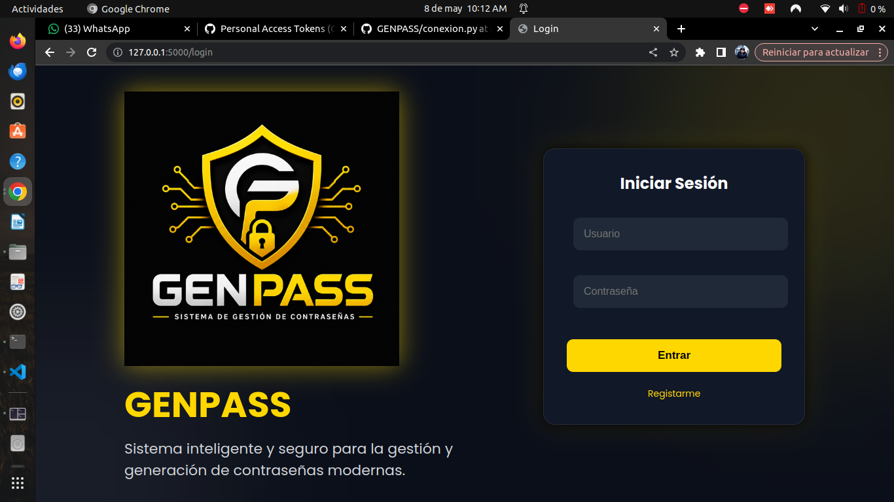
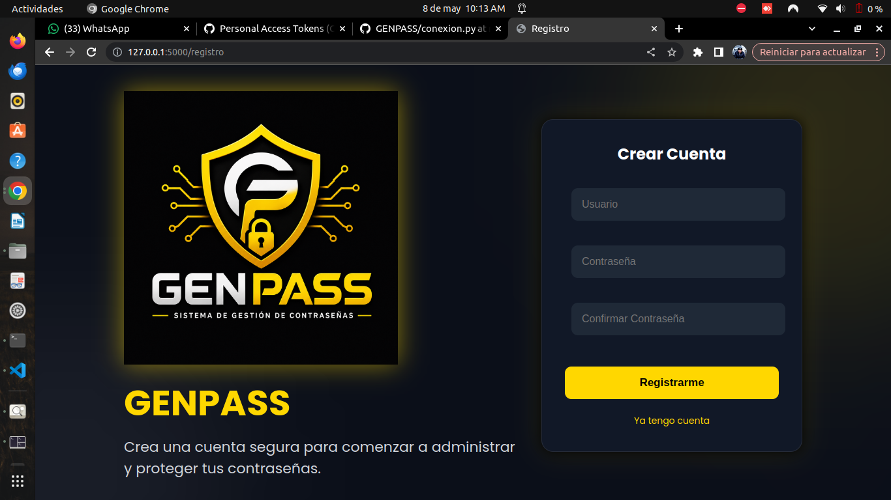
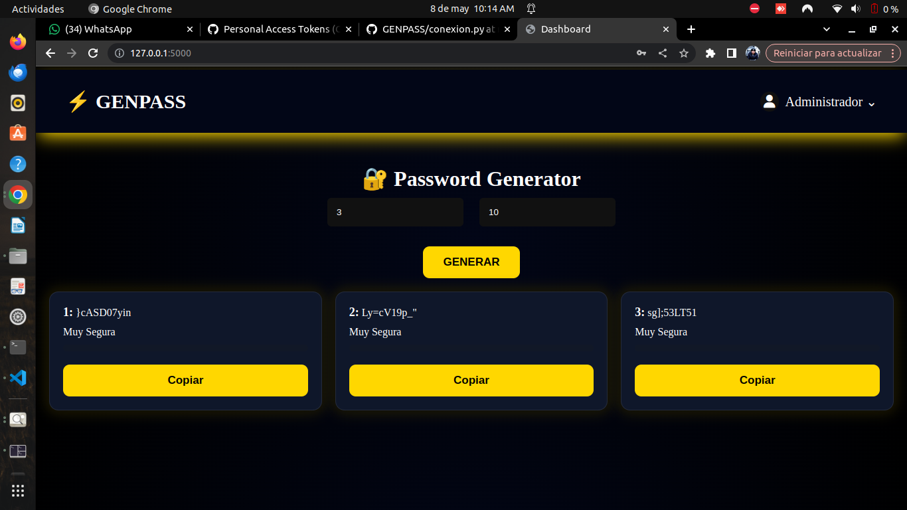
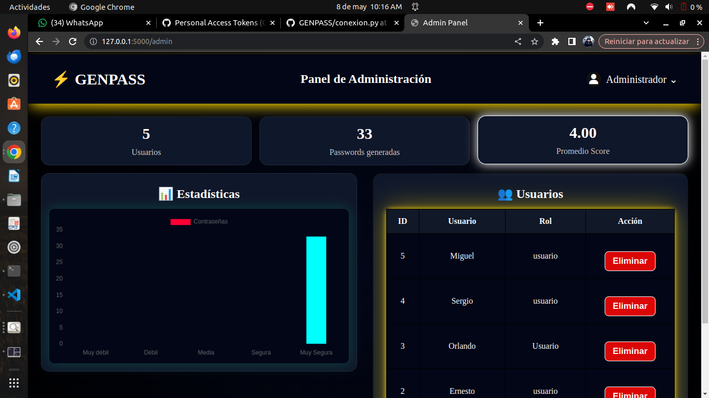
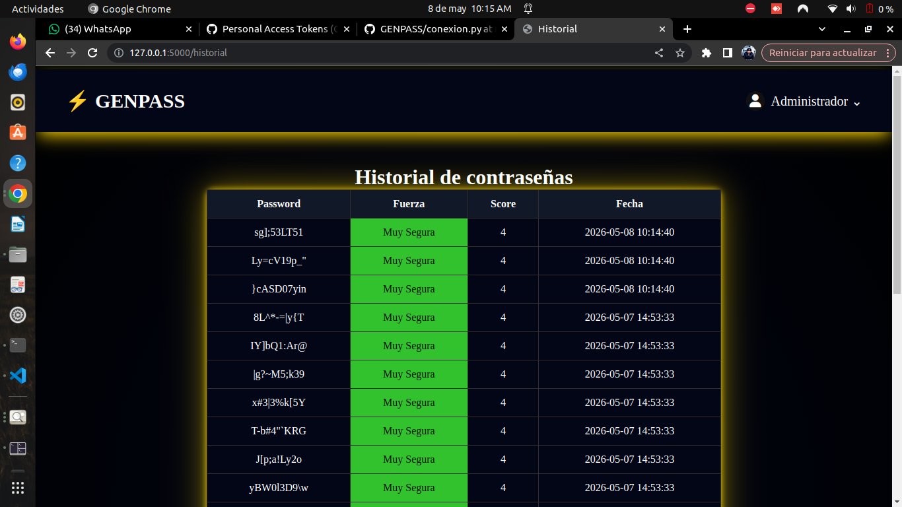

## GENPASS 
Sistema web de generación de contraseñas seguras desarrollado con Flask y MariaDB. Incluye autenticación de usuarios, historial de contraseñas, panel de administración y análisis de fortaleza en tiempo real.

## Características
Generación segura
Historial
Login
Panel administrador
Copiado al portapapeles

## Tecnologías
Python
Flask
MariaDB
HTML
CSS
JavaScript

## Capturas
## Login

## Regitro

## Dashboard

## Panel

## Historial

